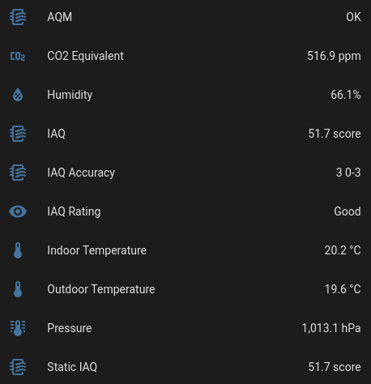

+++
title = 'Custom air quality monitor with Home Assistant integration'
date = 2025-10-20T17:13:08+01:00
draft = true
summary = "A custom air quality monitor / weather station created using commonly available sensors."
[params]
    repo = 'https://github.com/dancs-dev/esp32-weather-station'
+++

## Introduction

In recent years, people are becoming increasingly aware of the importance of good indoor air quality. A lack of ventilation can quickly lead to a build up of pollutants. To be able to improve your air quality, one has to know what the current air quality is so that they can take action such as opening a window (or even better - automatically triggering a ventilation system of some form). There are various commercial off-the-shelf air quality monitors (AQMs) available, but they can be relatively costly, have a closed ecosystem, and can raise privacy and security concerns if cloud-based. I wanted to make my own AQM that would sit on the local network and be interoperable with Home Assistant.

## The board and sensors

- ESP32 - inexpensive microcontroller with WiFi.
- BME680 - indoor temperature, humidity, pressure, and air quality. It measures VOCs in the air and creates a score as well as CO2 estimate based on this.
- DS18B20 - waterproof version for outdoor temperature.

### Code

I used [PlatformIO](https://platformio.org/) to develop the code for the AQM, partly because it integrates well with VSCode and partly because the project configuration file seems like a good way to manage the project dependencies. In terms of reading from the sensors, I used the BSEC 2 library for reading data from the BME 680 (I originally used BSEC but eagerly upgraded once this was available due to reliability and accuracy reasons), and the Dallas Temperature library for reading data from the DS18B20.

The code runs a few threads - one for reading data from each of the sensors, and one (after a lot of debugging as to why the AQM would occasionally stop working) for re-connecting to WiFi if the connection is lost. The main loop handles HTTP requests and returns the readings in a JSON format.

### Home Assistant

To track historical data and operate with other smart devices, I used a Home Assistant template to import the AQM into my Home Assistant instance. This works but there is not a particularly easy way to add multiple AQMs. As a follow up, I plan to create a Home Assistant plugin to support this.

