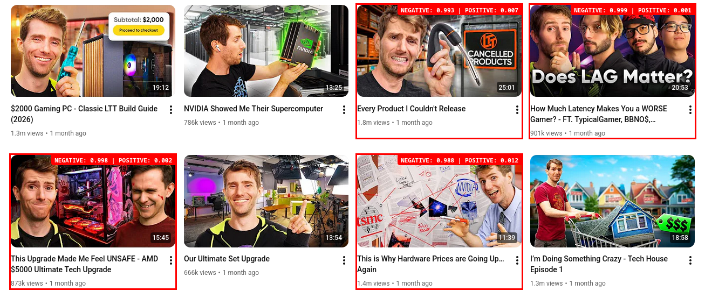
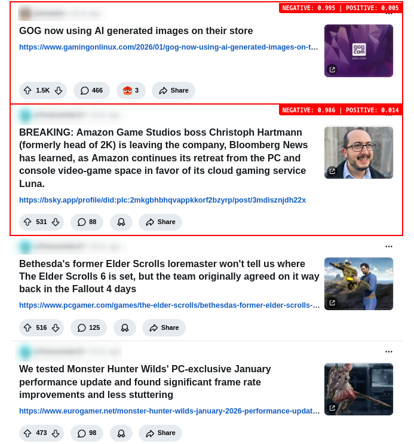
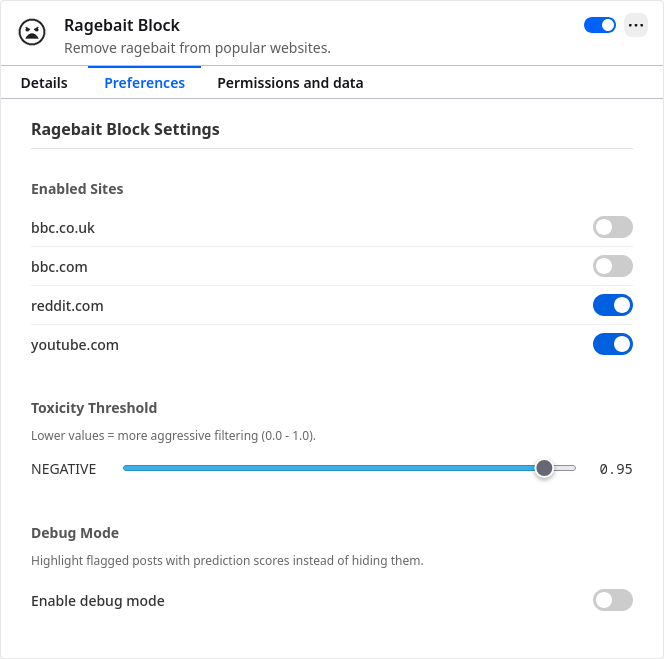

+++
title = 'Ragebait Block: on-device AI content filtering for a calmer feed'
date = 2026-01-28T17:58:50+00:00
draft = false
summary = "A Firefox extension that uses on-device machine learning to detect and hide negative content on YouTube, Reddit, and other popular sites."
[params]
    repo = 'https://github.com/dancs-dev/ragebait-block'
+++

## Introduction

Negativity sells. Each negative word in a news headline improves click-through rate by 2.3%[^negativity-clicks]. Research also shows that negative information and negative moods have a causal and bi-directional link[^negative-mental-health]. I wanted to create a tool to hide some of this negativity and provide a calmer feed. In doing so, I realised just how much of the web is negative.

Ragebait Block is a Firefox extension that uses [Firefox's new AI Platform API](https://firefox-source-docs.mozilla.org/toolkit/components/ml/index.html) to automatically classify text using an on-device machine learning model. When enabled for a supported website, it analyses the text of post titles and hides the post if it is above a certain negativity threshold.

The project has used the term 'ragebait' to refer to content that may have a negative sentiment and hence provoke a strong emotional reaction. I do not hold an opinion on this kind of content, but recognise that hiding this content could provide a calmer browsing experience.

### Visualising classification with the debug feature

The debug feature of the extension visualises what posts would be removed without actually removing them.

Here is the extension in action on one of my favourite tech YouTube channels:



In the world of PC gaming on Reddit:



With debug mode disabled, flagged posts would simply disappear from the feed.

## How it works

The extension works as you browse using a three-part architecture:

1. **Content script:** when browsing a supported and enabled website, it scans the DOM and extracts post containers and titles using site-specific CSS selectors. A `MutationObserver` monitors for dynamically loaded content, e.g., sites with infinite scroll. 
1. **Background script:** runs an ML engine (using Firefox's experimental `trial.ml` API with a Hugging Face text classification model) and classifies text as having 'NEGATIVE' or 'POSITIVE' sentiment.
1. **Message passing:** the content script sends title text to the background script via `browser.runtime.sendMessage()`, receives sentiment classification scores, and hides the post container where the score exceeds the user's configured threshold by setting `display: none`.

There is also a setup script that runs upon extension installation that prompts the user to grant permission to the required ML features. Additionally, an options script allows the user to adjust settings such as which sites are enabled, threshold for classification, and a debug mode to view what content would be flagged as negative without hiding it.

## Technology stack

- **Firefox WebExtensions API:** the [basis upon which the extension is built](https://developer.mozilla.org/en-US/docs/Mozilla/Add-ons/WebExtensions).
- **TrialML API:** [enables extensions to interface with the Firefox AI Platform API](https://firefox-source-docs.mozilla.org/toolkit/components/ml/extensions.html) to run a variety of machine learning tasks across supported models. It is built on top of [Transformers.js](https://huggingface.co/docs/transformers.js/index). 
- **Hugging Face text classification model:** [Xenova/distilbert-base-uncased-finetuned-sst-2-english](https://huggingface.co/Xenova/distilbert-base-uncased-finetuned-sst-2-english), a Transformers.js-compatible version of the popular [DistilBERT base uncased finetuned on the SST-2 dataset](https://huggingface.co/distilbert/distilbert-base-uncased-finetuned-sst-2-english). It classifies text into 'NEGATIVE' and 'POSITIVE' sentiment. Other models are available, but this worked well for general negativity classification.

## Configuration

### Options menu

The extension makes certain configuration options available in the browser, and sets sensible defaults:



### Supported sites

The current site configurations focus on filtering posts based on post title, but the extension could easily support filtering additional content such as comments - the CSS selectors for additional content would simply need to be added to the site's configuration.

- **Reddit:** posts based on post title.
- **YouTube:** videos based on video title.
- **BBC News (default: disabled):** articles based on article title.

### Adding support for a new site

Adding support for a site is simple, requiring only CSS selectors for the post container and title, setting whether to run by default on that site, and updating the manifest to allow the extension to run on that site.

**1. `scripts/block.js`**

Add a new entry to the `SITE_CONFIG` object with the site's hostname as the key:

```javascript
const SITE_CONFIG = {
  "example.com": {
    postContainer: "article.post", // CSS selector for post containers.
    titleSelector: "h2.title a", // CSS selector for title elements.
  },
  // ...
};
```

**2. `manifest.json`**

Add a match pattern to the `content_scripts` section:

```json
"content_scripts": [
  {
    "matches": [
      "*://*.example.com/*",
      // ...
    ],
    "js": ["scripts/block.js"]
  }
]
```

**3. `scripts/background.js`**

Add a default enabled state in the `DEFAULT_SETTINGS` object:

```javascript
const DEFAULT_SETTINGS = {
  enabledSites: {
    "example.com": true, // or false to disable by default
    // ...
  },
  // ...
};
```

## Performance and user experience

When the extension is first installed, it can take a moment to download the model. Once the model has been cached, it is much faster.

Based on my testing in a modest VM with 4 cores and no GPU passthrough, when visiting a supported site, it takes around 3-5 seconds for the initial batch of posts to be processed. Once that is done, as infinite scroll tends to pre-load posts below where you are currently at in the page, with normal usage the extension will classify them before you get a chance to see them. Using a `WeakSet` avoids classifying the same post more than once.

The machine learning model used for classification is not perfect. There will be false positives (content incorrectly classified as negative and hidden) as well as false negatives (not all negative content will be detected and hidden). As the goal of this project was to provide a calmer feed, the model used provides fairly aggressive filtering on anything negative, but other models such as [Xenova/toxic-bert](https://huggingface.co/Xenova/toxic-bert) could be used instead, focusing more on toxicity.

## Challenges and lessons learnt

Working with Firefox's experimental TrialML API presented some challenges - documentation and examples are sparse, and the API has evolved since some of the documentation was written. For example, [the documentation suggests that changing the ML task to `text-classification` would automatically default to using the DistilBERT SST-2 model](https://firefox-source-docs.mozilla.org/toolkit/components/ml/extensions.html#default-models), but I got very vague error messages until I realised that I needed to manually specify which model to use. I also had to carefully design the extension to enable additional sites to be added in a simple manner.

## What's next

- Publish the extension to the Firefox add-on store.
- Investigate compatibility with other browsers.
- Improve site support, both by adding new sites as well as filtering additional content such as comments on currently supported sites.
- Use OCR to also filter based on images/thumbnails.
- Support model selection within the extension options menu.

## Further reading

- [Transcription: local video subtitling with Whisper]() - another project using on-device ML to translate and transcribe videos.

[^negativity-clicks]: Robertson, C.E., et al. (2023). "Negativity drives online news consumption". *Nature Human Behaviour*.  https://www.nature.com/articles/s41562-023-01538-4
[^negative-mental-health]: Kelly, C.A. & Sharot, T. (2024). "Web-browsing patterns reflect and shape mood and mental health". *Nature Human Behaviour*. https://www.nature.com/articles/s41562-024-02065-6  